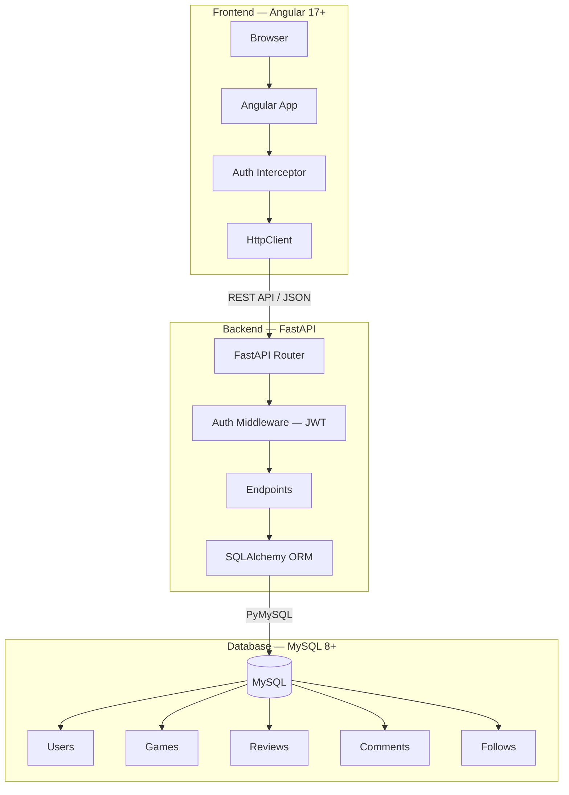
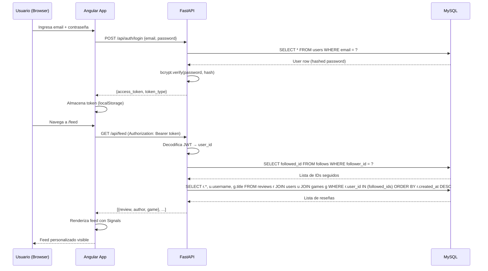

# GameLife MVP — Red Social de Reseñas de Videojuegos

## Descripción del Proyecto

**GameLife** es un MVP de red social donde los usuarios pueden registrarse, seguir a otros usuarios, escribir reseñas de videojuegos, comentar en reseñas ajenas y ver un feed personalizado basado en las personas que siguen.

**Stack obligatorio**: Angular 17+ · FastAPI (Python) · MySQL

---

## Arquitectura del Sistema



### Flujo de Datos (Login → Feed)



---

## Estructura de Carpetas Propuesta

```
GameLife/
├── backend/
│   ├── venv/                      # Entorno virtual (no se sube a Git)
│   ├── app/
│   │   ├── __init__.py
│   │   ├── main.py                # Entry point FastAPI
│   │   ├── config.py              # Settings con pydantic-settings
│   │   ├── database.py            # Engine + SessionLocal + Base
│   │   ├── models.py              # Modelos SQLAlchemy
│   │   ├── schemas.py             # Schemas Pydantic (request/response)
│   │   ├── auth/
│   │   │   ├── __init__.py
│   │   │   ├── router.py          # POST /login, POST /register
│   │   │   ├── dependencies.py    # get_current_user dependency
│   │   │   └── utils.py           # JWT create/verify, password hash
│   │   ├── routers/
│   │   │   ├── __init__.py
│   │   │   ├── users.py           # GET /users/{id}, GET /users/{id}/reviews
│   │   │   ├── games.py           # GET /games, GET /games/{id}
│   │   │   ├── reviews.py         # CRUD reseñas
│   │   │   ├── comments.py        # CRUD comentarios
│   │   │   ├── follows.py         # POST /follow, DELETE /unfollow
│   │   │   └── feed.py            # GET /feed (personalizado)
│   │   └── utils/
│   │       └── __init__.py
│   ├── sql/
│   │   └── init_db.sql            # Script DDL + datos iniciales
│   ├── requirements.txt
│   ├── .env.example               # Plantilla de variables de entorno
│   └── .gitignore
│
├── frontend/
│   ├── src/
│   │   ├── app/
│   │   │   ├── core/
│   │   │   │   ├── interceptors/
│   │   │   │   │   └── auth.interceptor.ts
│   │   │   │   ├── guards/
│   │   │   │   │   └── auth.guard.ts
│   │   │   │   └── services/
│   │   │   │       ├── auth.service.ts
│   │   │   │       └── api.service.ts
│   │   │   ├── shared/
│   │   │   │   ├── components/
│   │   │   │   │   ├── navbar/
│   │   │   │   │   ├── star-rating/
│   │   │   │   │   └── game-card/
│   │   │   │   └── models/
│   │   │   │       ├── user.model.ts
│   │   │   │       ├── game.model.ts
│   │   │   │       ├── review.model.ts
│   │   │   │       └── comment.model.ts
│   │   │   ├── features/
│   │   │   │   ├── auth/
│   │   │   │   │   ├── login/
│   │   │   │   │   └── register/
│   │   │   │   ├── dashboard/
│   │   │   │   │   └── dashboard.component.ts
│   │   │   │   ├── game-detail/
│   │   │   │   │   └── game-detail.component.ts
│   │   │   │   ├── profile/
│   │   │   │   │   └── profile.component.ts
│   │   │   │   └── feed/
│   │   │   │       └── feed.component.ts
│   │   │   ├── app.component.ts
│   │   │   ├── app.config.ts
│   │   │   └── app.routes.ts
│   │   ├── assets/
│   │   ├── index.html
│   │   └── styles.css
│   ├── angular.json
│   ├── package.json
│   └── tsconfig.json
│
└── README.md                      # Documentación exhaustiva
```

---

## Diccionario de Datos

### Tabla `users`

| Columna        | Tipo             | Restricciones                     | Descripción                |
|----------------|------------------|-----------------------------------|----------------------------|
| `id`           | INT              | PK, AUTO_INCREMENT                | Identificador único        |
| `username`     | VARCHAR(50)      | UNIQUE, NOT NULL                  | Nombre de usuario          |
| `email`        | VARCHAR(100)     | UNIQUE, NOT NULL                  | Correo electrónico         |
| `hashed_password` | VARCHAR(255)  | NOT NULL                          | Contraseña hasheada (bcrypt)|
| `avatar_url`   | VARCHAR(500)     | NULL                              | URL de avatar              |
| `bio`          | TEXT             | NULL                              | Biografía del usuario      |
| `created_at`   | DATETIME         | DEFAULT CURRENT_TIMESTAMP         | Fecha de registro          |

### Tabla `games`

| Columna        | Tipo             | Restricciones                     | Descripción                |
|----------------|------------------|-----------------------------------|----------------------------|
| `id`           | INT              | PK, AUTO_INCREMENT                | Identificador único        |
| `title`        | VARCHAR(200)     | NOT NULL                          | Título del juego           |
| `description`  | TEXT             | NULL                              | Descripción                |
| `genre`        | VARCHAR(100)     | NULL                              | Género del juego           |
| `platform`     | VARCHAR(100)     | NULL                              | Plataformas                |
| `cover_url`    | VARCHAR(500)     | NULL                              | URL de portada             |
| `release_year` | INT              | NULL                              | Año de lanzamiento         |
| `created_at`   | DATETIME         | DEFAULT CURRENT_TIMESTAMP         | Fecha de creación del registro |

### Tabla `reviews`

| Columna        | Tipo             | Restricciones                     | Descripción                |
|----------------|------------------|-----------------------------------|----------------------------|
| `id`           | INT              | PK, AUTO_INCREMENT                | Identificador único        |
| `user_id`      | INT              | FK → users.id, NOT NULL           | Autor de la reseña         |
| `game_id`      | INT              | FK → games.id, NOT NULL           | Juego reseñado             |
| `rating`       | INT              | NOT NULL, CHECK(1-5)              | Puntuación (1-5 estrellas) |
| `content`      | TEXT             | NOT NULL                          | Texto de la reseña         |
| `created_at`   | DATETIME         | DEFAULT CURRENT_TIMESTAMP         | Fecha de publicación       |
| `updated_at`   | DATETIME         | ON UPDATE CURRENT_TIMESTAMP       | Última modificación        |

> **Constraint**: UNIQUE(user_id, game_id) — Un usuario solo puede escribir una reseña por juego.

### Tabla `comments`

| Columna        | Tipo             | Restricciones                     | Descripción                |
|----------------|------------------|-----------------------------------|----------------------------|
| `id`           | INT              | PK, AUTO_INCREMENT                | Identificador único        |
| `user_id`      | INT              | FK → users.id, NOT NULL           | Autor del comentario       |
| `review_id`    | INT              | FK → reviews.id, NOT NULL         | Reseña comentada           |
| `content`      | TEXT             | NOT NULL                          | Texto del comentario       |
| `created_at`   | DATETIME         | DEFAULT CURRENT_TIMESTAMP         | Fecha de publicación       |

### Tabla `follows` (Autorreferenciada M:N)

| Columna        | Tipo             | Restricciones                     | Descripción                |
|----------------|------------------|-----------------------------------|----------------------------|
| `follower_id`  | INT              | FK → users.id, NOT NULL           | Usuario que sigue          |
| `followed_id`  | INT              | FK → users.id, NOT NULL           | Usuario seguido            |
| `created_at`   | DATETIME         | DEFAULT CURRENT_TIMESTAMP         | Fecha del follow           |

> **Constraint**: PK compuesta (follower_id, followed_id). CHECK(follower_id ≠ followed_id) para evitar auto-follow.

---

## Proposed Changes

### 1. Backend — Python/FastAPI

#### [NEW] `backend/requirements.txt`
Dependencias del proyecto:
- `fastapi`, `uvicorn[standard]`, `sqlalchemy`, `pymysql`, `python-jose[cryptography]`, `passlib[bcrypt]`, `python-dotenv`, `pydantic-settings`, `python-multipart`

#### [NEW] `backend/.env.example`
Template con `DATABASE_URL`, `SECRET_KEY`, `ALGORITHM`, `ACCESS_TOKEN_EXPIRE_MINUTES`.

#### [NEW] `backend/.gitignore`
Ignorar `venv/`, `__pycache__/`, `.env`, etc.

#### [NEW] `backend/sql/init_db.sql`
- DDL completo para las 5 tablas con sus claves foráneas, checks y constraints.
- INSERT de ~8 juegos pre-poblados (clásicos y modernos).
- Índices para optimizar consultas del feed.

#### [NEW] `backend/app/__init__.py`
Archivo vacío para marcar como paquete Python.

#### [NEW] `backend/app/config.py`
Clase `Settings` usando `pydantic-settings` que carga variables de `.env`.

#### [NEW] `backend/app/database.py`
- `create_engine()` con URL de MySQL.
- `SessionLocal` como factory de sesiones.
- `Base` declarativo de SQLAlchemy.
- Dependency `get_db()` para inyección en endpoints.

#### [NEW] `backend/app/models.py`
Modelos SQLAlchemy: `User`, `Game`, `Review`, `Comment`, tabla `follows`.

#### [NEW] `backend/app/schemas.py`
Schemas Pydantic para validación:
- `UserCreate`, `UserResponse`, `UserProfile`
- `GameResponse`, `GameList`
- `ReviewCreate`, `ReviewResponse`, `ReviewWithDetails`
- `CommentCreate`, `CommentResponse`
- `FollowAction`
- `Token`, `TokenData`
- `FeedItem`

#### [NEW] `backend/app/auth/utils.py`
- `hash_password()` y `verify_password()` con passlib/bcrypt.
- `create_access_token()` y `decode_access_token()` con python-jose.

#### [NEW] `backend/app/auth/dependencies.py`
- `get_current_user()` — dependency de FastAPI que extrae el JWT del header `Authorization`, lo decodifica y retorna el usuario desde la DB.

#### [NEW] `backend/app/auth/router.py`
- `POST /api/auth/register` — Registrar usuario nuevo.
- `POST /api/auth/login` — Login con OAuth2PasswordRequestForm, retorna JWT.

#### [NEW] `backend/app/routers/users.py`
- `GET /api/users/{user_id}` — Perfil público de un usuario.
- `GET /api/users/{user_id}/reviews` — Reseñas de un usuario.
- `GET /api/users/me` — Perfil del usuario autenticado.

#### [NEW] `backend/app/routers/games.py`
- `GET /api/games` — Listar todos los juegos (con paginación).
- `GET /api/games/{game_id}` — Detalle de un juego con sus reseñas.

#### [NEW] `backend/app/routers/reviews.py`
- `POST /api/reviews` — Crear reseña (autenticado).
- `GET /api/reviews/{review_id}` — Detalle de reseña con comentarios.
- `PUT /api/reviews/{review_id}` — Editar reseña propia.
- `DELETE /api/reviews/{review_id}` — Eliminar reseña propia.

#### [NEW] `backend/app/routers/comments.py`
- `POST /api/reviews/{review_id}/comments` — Comentar en una reseña.
- `DELETE /api/comments/{comment_id}` — Eliminar comentario propio.

#### [NEW] `backend/app/routers/follows.py`
- `POST /api/users/{user_id}/follow` — Seguir a un usuario.
- `DELETE /api/users/{user_id}/follow` — Dejar de seguir.
- `GET /api/users/{user_id}/followers` — Lista de seguidores.
- `GET /api/users/{user_id}/following` — Lista de seguidos.

#### [NEW] `backend/app/routers/feed.py`
- `GET /api/feed` — **Feed personalizado**: Consulta las reseñas de los usuarios que el usuario actual sigue, ordenadas por fecha descendente, con paginación (`skip`, `limit`).

#### [NEW] `backend/app/main.py`
- Instancia de FastAPI con metadata (título, descripción, versión).
- Configuración de CORS para Angular (`http://localhost:4200`).
- Inclusión de todos los routers con prefijo `/api`.
- Evento `on_startup` para crear tablas (opcional, preferiblemente vía SQL script).

---

### 2. Frontend — Angular 17+

> [!IMPORTANT]
> Se creará el proyecto Angular usando `npx -y @angular/cli@latest new frontend --standalone --routing --style=css --ssr=false --skip-tests` dentro del workspace.

#### [NEW] `frontend/src/app/core/services/auth.service.ts`
- Signal `currentUser` para estado del usuario autenticado.
- Signal `isAuthenticated` derivado con `computed()`.
- Métodos: `login()`, `register()`, `logout()`, `getToken()`.
- Almacenamiento del JWT en localStorage.

#### [NEW] `frontend/src/app/core/services/api.service.ts`
- Servicio base con HttpClient para llamadas al backend.
- Métodos genéricos: `get<T>()`, `post<T>()`, `put<T>()`, `delete<T>()`.
- Base URL configurable via `environment.ts`.

#### [NEW] `frontend/src/app/core/interceptors/auth.interceptor.ts`
- Functional interceptor que adjunta `Authorization: Bearer <token>` a cada request.
- Manejo de 401 para redirigir al login.

#### [NEW] `frontend/src/app/core/guards/auth.guard.ts`
- Functional guard que verifica si el usuario está autenticado.
- Redirige a `/login` si no hay token.

#### [NEW] `frontend/src/app/shared/models/*.model.ts`
- Interfaces TypeScript: `User`, `Game`, `Review`, `Comment`, `FeedItem`.

#### [NEW] `frontend/src/app/shared/components/navbar/`
- Barra de navegación responsiva con links a Dashboard, Feed, Perfil, Login/Logout.
- Muestra el username del usuario si está autenticado (via Signal).

#### [NEW] `frontend/src/app/shared/components/star-rating/`
- Componente reutilizable de puntuación con estrellas (1-5). Input/Output.

#### [NEW] `frontend/src/app/shared/components/game-card/`
- Tarjeta visual de un juego con portada, título, género y rating promedio.

#### [NEW] `frontend/src/app/features/auth/login/`
- Formulario de login con validación reactiva.
- Llama a `AuthService.login()`.

#### [NEW] `frontend/src/app/features/auth/register/`
- Formulario de registro con validaciones.

#### [NEW] `frontend/src/app/features/dashboard/dashboard.component.ts`
- Grid de videojuegos obtenidos desde `GET /api/games`.
- Usa `GameCardComponent` para renderizar cada juego.
- Barra de búsqueda/filtro por género.

#### [NEW] `frontend/src/app/features/feed/feed.component.ts`
- Lista de reseñas del feed personalizado (`GET /api/feed`).
- Muestra autor, juego, rating, contenido, fecha.
- Scroll infinito o paginación.

#### [NEW] `frontend/src/app/features/profile/profile.component.ts`
- Perfil del usuario con avatar, bio, stats (seguidores/seguidos).
- Lista de reseñas del usuario.
- Botón Follow/Unfollow (solo en perfiles ajenos).

#### [NEW] `frontend/src/app/features/game-detail/game-detail.component.ts`
- Detalle de un juego con todas sus reseñas.
- Formulario para escribir una nueva reseña.

#### [MODIFY] `frontend/src/app/app.routes.ts`
Rutas lazy-loaded:
- `/` → Dashboard
- `/login` → Login
- `/register` → Register
- `/feed` → Feed (guarded)
- `/profile/:id` → Profile
- `/games/:id` → Game Detail

#### [MODIFY] `frontend/src/app/app.config.ts`
- Registrar `provideHttpClient(withInterceptors([authInterceptor]))`.
- Registrar `provideRouter(routes)`.

#### [MODIFY] `frontend/src/styles.css`
- Design system global: variables CSS, tipografía (Inter/Outfit), dark mode, utilidades.

---

### 3. Documentación

#### [NEW] `README.md`
README exhaustivo en la raíz del proyecto con:
- Descripción del proyecto
- Arquitectura del sistema (diagrama)
- Flujo de datos detallado
- Diccionario de datos completo
- Instrucciones paso a paso para:
  1. Clonar el repositorio
  2. Configurar MySQL y ejecutar `init_db.sql`
  3. Crear entorno virtual Python + instalar dependencias
  4. Configurar `.env`
  5. Arrancar el backend con Uvicorn
  6. Instalar dependencias Angular + arrancar frontend
- Endpoints de la API (tabla resumen)
- Variables de entorno documentadas

---

## User Review Required

> [!IMPORTANT]
> **Conexión a MySQL**: Necesito confirmar que tienes MySQL Server instalado y corriendo localmente. El script SQL y la configuración asumirán `localhost:3306`. ¿Tienes credenciales específicas (usuario/contraseña) que prefieras usar, o usamos `root` con una contraseña configurable via `.env`?

> [!IMPORTANT]
> **Node.js y Angular CLI**: Se requiere Node.js 18+ para Angular 17+. ¿Lo tienes instalado? Verificaremos con `node --version` y `npm --version` antes de crear el proyecto Angular.

> [!IMPORTANT]
> **Python**: Se necesita Python 3.10+. ¿Lo tienes disponible en tu PATH como `python` o como `py`?

---

## Open Questions

> [!WARNING]
> **Scope del MVP**: Este plan implementa los entregables iniciales que solicitaste (SQL script, main.py, models.py, schemas, README.md) más la estructura completa para que sea funcional. ¿Quieres que implemente **todos** los endpoints y componentes Angular ahora, o prefieres los entregables iniciales primero y luego iterar?

> [!NOTE]
> **Datos de juegos pre-poblados**: Incluiré ~8 juegos representativos (The Legend of Zelda: TOTK, Elden Ring, Baldur's Gate 3, Cyberpunk 2077, Hades, Hollow Knight, God of War: Ragnarök, The Last of Us Part II). ¿Tienes preferencias?

---

## Verification Plan

### Automated Tests
1. **Backend**: Arrancar el servidor con `uvicorn app.main:app --reload` y verificar que responde en `http://localhost:8000/docs` (Swagger UI).
2. **SQL**: Ejecutar `init_db.sql` en MySQL y verificar que las 5 tablas se crean correctamente con `SHOW TABLES;`.
3. **Frontend**: Ejecutar `ng serve` y verificar que compila sin errores y carga en `http://localhost:4200`.

### Manual Verification
- Probar el flujo de registro → login → obtener token → acceder a endpoints protegidos usando la UI de Swagger.
- Verificar CORS entre Angular (4200) y FastAPI (8000).
- Comprobar que el feed personalizado retorna solo reseñas de usuarios seguidos.
